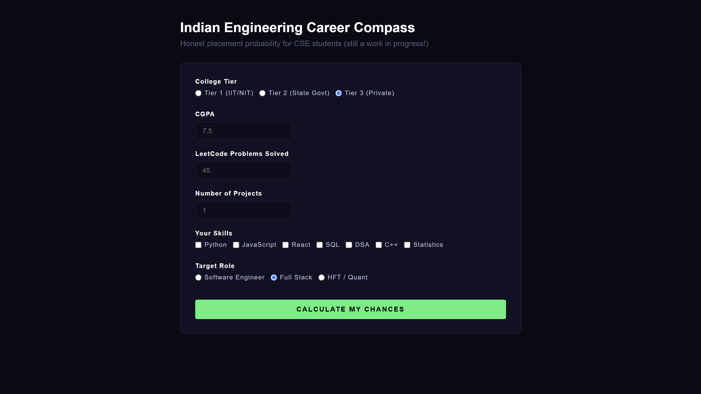

# Indian Engineering Career Compass

A small web tool that gives Indian CSE students a rough, honest placement probability estimate based on college tier, CGPA, LeetCode count, project count, and skills — instead of vague generic advice.

**Live demo:** https://sakshamshandilya01.github.io/career-compass/

## Screenshots

**Form view**

**Results view**

## What it does
- Fill out a short form about your profile
- Click "Calculate My Chances"
- See your estimated placement probability for Product Companies, Service Companies, and HFT/Quant roles
- Get specific skill gaps and a 30-day action plan

## Tech used
- HTML for structure
- CSS for the dark UI
- Vanilla JavaScript for the scoring logic and DOM updates (no frameworks)

## Known gaps / what I'm adding next
- Startup score category isn't built yet — dropped it for v1
- Week 3/4 of the action plan are still generic, not personalized like week 1/2
- Not mobile responsive yet
- Scoring weights are my own estimates, not based on real placement data — open to feedback on this
- No backend/database, everything runs client-side

## Why I built this
I'm a first-year B.Tech student learning HTML, CSS, and JS, and wanted a practice project that was actually useful instead of a to-do list app. Feedback very welcome, especially on the scoring logic.
